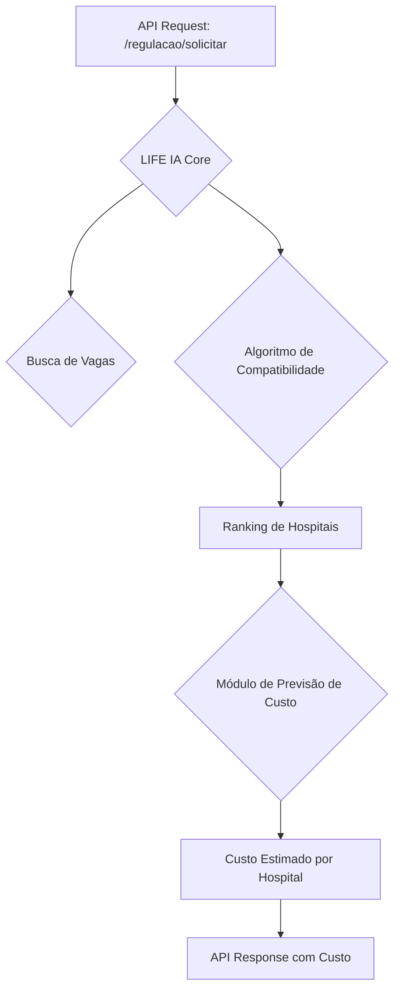
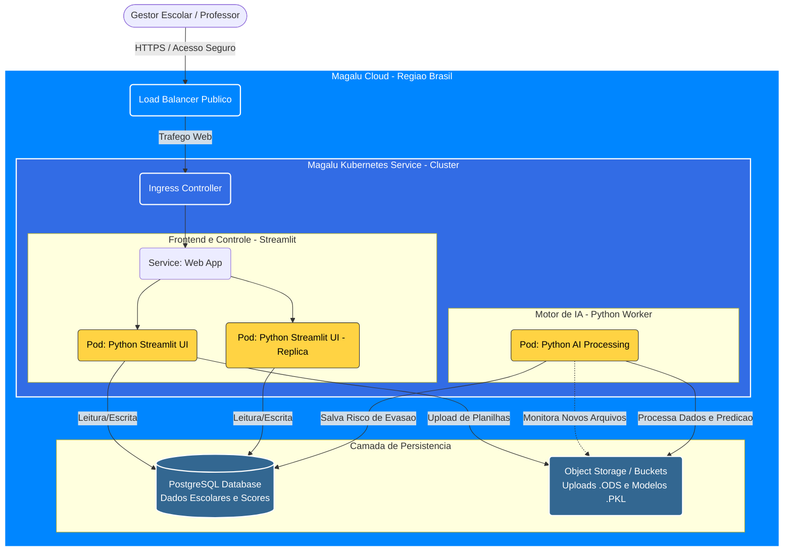
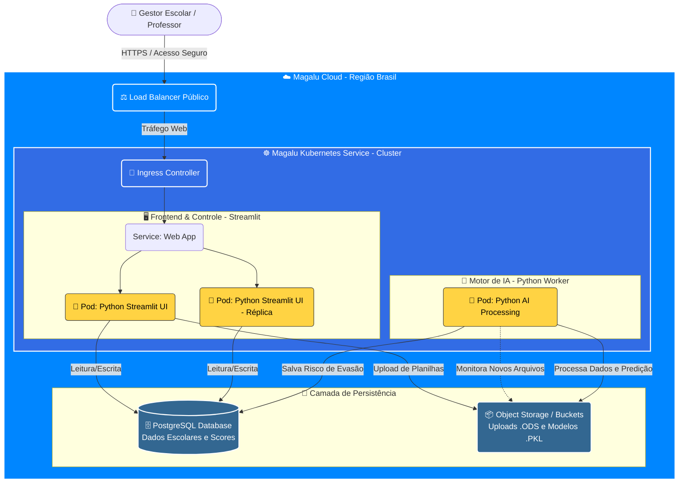

# 🏥 Módulo de Previsão de Custo

**Autor**: Livia Mor  
**Data**: 29 de Novembro de 2025  
**Status**: Proposta

## 1. Visão Geral

Este documento descreve a arquitetura e o funcionamento do **Módulo de Previsão de Custo de Internação**, uma nova funcionalidade proposta para o sistema LIFE IA. O objetivo deste módulo é estimar o custo financeiro de uma internação hospitalar no momento da regulação do paciente, fornecendo uma ferramenta valiosa para a gestão de recursos do SUS.

## 2. Objetivo

O objetivo principal é prover uma estimativa de custo (em Reais) para cada sugestão de hospital gerada pelo sistema de regulação. Isso permitirá que os gestores do SUS:

-   **Otimizem a alocação de recursos financeiros**: Escolher hospitais que ofereçam o melhor custo-benefício para o tratamento necessário.
-   **Aumentem a transparência**: Fornecer dados financeiros para auditoria e planejamento orçamentário.
-   **Melhorem o planejamento estratégico**: Analisar tendências de custo por especialidade, hospital e CID.

## 3. Arquitetura e Integração

O módulo será integrado ao `LIFE IA-api` e seguirá a arquitetura de microsserviços existente.

-   **Novo Arquivo**: `life_ia/cost_forecasting.py` será criado para encapsular a lógica do modelo de previsão.
-   **Modelo de ML**: Um modelo treinado (ex: `custo_internacao_v1.joblib`) será armazenado no diretório `models/`.
-   **Integração**: O `main.py` será modificado para chamar o módulo de previsão de custo após a seleção dos hospitais. O custo estimado será adicionado à resposta da API.



## 4. Fonte de Dados para Treinamento

Para treinar o modelo de previsão de custo, utilizaremos as seguintes fontes de dados:

-   **Dados Históricos de Internação (SIH/SUS)**: Contém informações detalhadas sobre custos de milhares de internações passadas.
-   **Tabela de Procedimentos do SUS**: Fornece os custos base para cada procedimento.
-   **Cadastro Nacional de Estabelecimentos de Saúde (CNES)**: Informações sobre os hospitais.
-   **CID-10**: Classificação da doença do paciente.

**Features para o modelo**:
-   `hospital_cnes` (categórica)
-   `cid_principal` (categórica)
-   `especialidade_destino` (categórica)
-   `idade_paciente` (numérica)
-   `tempo_permanencia_estimado` (numérica, a ser criada)
-   `procedimento_principal` (categórica)

## 5. Modelo de Machine Learning

Propõe-se o uso de um modelo de **Gradient Boosting** (como LightGBM ou XGBoost) devido à sua alta performance com dados tabulares.

-   **Target**: `valor_total_internacao` (numérica)
-   **Métricas de Avaliação**: Erro Médio Absoluto (MAE) e R-quadrado (R²).
-   **Treinamento**: O modelo será treinado offline usando os dados históricos e re-treinado periodicamente (a cada 3 meses) para se adaptar a novas tendências de custo.

## 6. Alterações na API

A resposta do endpoint `/regulacao/solicitar` será enriquecida com a informação de custo.

### Exemplo de Resposta Atualizada

```json
{
  "solicitacao_id": "REG_20251129_103000",
  "hospitais_sugeridos": [
    {
      "hospital_cnes": "2337177",
      "hospital_nome": "HUGOL",
      "score_compatibilidade": 85.5,
      "vagas_disponiveis": 3,
      "justificativa": "ALTA COMPATIBILIDADE - 3 vagas disponíveis",
      "distancia_km": 25.0,
      "tempo_estimado_min": 50,
      "custo_estimado_reais": 15250.75,
      "custo_estimado_detalhes": {
        "procedimentos": 9800.50,
        "diarias_uti": 4500.25,
        "materiais_e_medicamentos": 950.00
      }
    }
  ],
  "total_vagas_encontradas": 6
}
```

## 7. Próximos Passos

1.  **Coleta e Preparação dos Dados**: Obter acesso aos dados históricos do SIH/SUS.
2.  **Prova de Conceito (PoC)**: Desenvolver um notebook para treinar e avaliar a primeira versão do modelo.
3.  **Implementação**: Desenvolver o arquivo `cost_forecasting.py` e integrá-lo à API.
4.  **Testes**: Criar testes unitários e de integração para o novo módulo.
5.  **Deploy**: Publicar a nova versão da API com a funcionalidade de previsão de custo.

## 8. Estimativa de Custo de Infraestrutura

Esta seção apresenta uma estimativa de custo mensal para a infraestrutura necessária para rodar o sistema LIFE IA em um ambiente de produção de pequena escala. Os custos são aproximados e podem variar com o uso real e as configurações específicas.

**Componentes da Infraestrutura:**
-   **Servidor da API**: Máquina virtual para rodar a aplicação FastAPI (2 vCPUs, 4 GB RAM).
-   **Banco de Dados**: Instância gerenciada de PostgreSQL para o sistema de auditoria (~100 GB de armazenamento).
-   **Treinamento do Modelo**: Uso esporádico de uma máquina com mais poder de processamento para re-treinamento do modelo de ML (estimado em 4 horas/mês).

**Tabela Comparativa de Custos (Estimativa Mensal em BRL):**

| Provedor          | Custo Mensal Estimado (BRL) | Observações                               |
| ----------------- | --------------------------- | ----------------------------------------- |
| **AWS**           | **~R$ 400**                 | Custo pode variar com créditos e região.  |
| **GCP**           | **~R$ 405**                 | Preços competitivos e boa integração com ML.|
| **Azure**         | **~R$ 490**                 | Ecossistema robusto, um pouco mais caro.  |
| **DigitalOcean**  | **~R$ 464**                 | Simples e direto, mas DB gerenciado é caro.|
| **Magalu Cloud**  | **~R$ 248**                 | **Preços em BRL, sem variação cambial.**  |

_*Valores para AWS, GCP, Azure e DigitalOcean são baseados em estimativas de custo em Dólar (USD) e convertidos para Reais (BRL) a uma taxa de câmbio de 1 USD = 5.33 BRL (Novembro de 2025). O custo do Magalu Cloud é baseado diretamente em seus preços em BRL._

### Estratégia de Implantação com Kubernetes para Evitar Vendor Lock-in

A tabela de custos acima considera uma abordagem tradicional baseada em máquinas virtuais e serviços gerenciados. Para garantir a portabilidade e evitar a dependência de um único provedor de nuvem (*vendor lock-in*), recomenda-se o uso de **Kubernetes (K8s)** como plataforma de orquestração de contêineres.

**Benefícios:**
-   **Portabilidade**: A aplicação pode ser movida entre diferentes provedores de nuvem (AWS, GCP, Azure, etc.) ou para uma infraestrutura on-premise com o mínimo de alterações.
-   **Escalabilidade**: O Kubernetes facilita a escalabilidade automática da aplicação para lidar com picos de demanda.
-   **Padrão de Mercado**: Utiliza uma tecnologia padrão da indústria, com uma vasta comunidade e ecossistema de ferramentas.

**Arquitetura Cloud-Agnostic com Kubernetes:**
-   **Aplicação**: A API do LIFE IA seria empacotada em uma imagem de contêiner (Docker).
-   **Banco de Dados**: Em vez de usar um serviço gerenciado específico do provedor (como AWS RDS ou Google Cloud SQL), poderia-se usar um **operador de banco de dados** (ex: [Zalando Postgres Operator](https://github.com/zalando/postgres-operator)) que roda dentro do próprio cluster Kubernetes. Isso abstrai a complexidade do banco de dados e o torna portátil.
-   **Implantação**: A implantação seria descrita em manifestos YAML do Kubernetes, que são agnósticos à nuvem.

Adotar o Kubernetes pode alterar a estrutura de custos. Embora os serviços gerenciados de Kubernetes (como EKS na AWS, GKE no GCP, AKS no Azure) tenham um custo, a flexibilidade e a ausência de *lock-in* a longo prazo podem representar uma economia estratégica significativa.

**Conclusão da Estimativa:**

-   **Magalu Cloud** apresenta o custo mais competitivo, especialmente por ter preços em Reais, o que elimina a variação cambial para operações no Brasil.
-   **AWS** e **GCP** oferecem um balanço equilibrado entre custo e a vasta gama de serviços de IA/ML disponíveis.
-   **DigitalOcean** é uma opção simples e rápida para subir a aplicação, mas o custo do banco de dados gerenciado pode pesar.
-   **Azure** é uma opção forte para empresas que já utilizam o ecossistema Microsoft, apesar do custo um pouco mais elevado.

Para um projeto governamental focado no Brasil, como o LIFE IA, **Magalu Cloud** surge como uma opção estratégica e de baixo custo.

Aqui estão as tabelas convertidas para Markdown, baseadas nas imagens fornecidas.

**Nota sobre a conversão:** Para o cálculo, utilizei uma taxa de câmbio estimada de **USD 1,00 = BRL 6,00** para fornecer uma margem de segurança orçamentária (considerando possíveis impostos como IOF e variações cambiais).

### 1. Amazon Web Services (AWS)

[cite_start]Baseado na imagem enviada[cite: 1], esta configuração utiliza instâncias `c6g.xlarge` (ARM Graviton) e um cluster EKS.

| Serviço | Uso / Configuração | Custo Mensal (USD) | Custo Mensal (BRL)* |
| :--- | :--- | :--- | :--- |
| **Public IPv4 Address** | Number of public IPv4 addresses in use (1) | $3.65 | R$ 21,90 |
| **Data Transfer** | DT Inbound: Internet (100 GB/mês), DT Outbound: Internet (100 GB/mês) | $9.00 | R$ 54,00 |
| **Amazon EKS** | Number of EKS Clusters (1) | $73.00 | R$ 438,00 |
| **Application Load Balancer** | Number of Application Load Balancers (1) | $19.23 | R$ 115,38 |
| **Amazon Elastic File System (EFS)** | Storage Capacity (100GB) claimed by EKS cluster | $2.49 | R$ 14,94 |
| **Amazon EC2** | Shared Instances, Linux, Consistent, 2 Instances, c6g.xlarge, 4vCPU/8GB. On-Demand Utilization: 100%, EBS Storage (30 GB) | $203.36 | R$ 1.220,16 |
| **TOTAL** | | **$310.73** | **R$ 1.864,38** |

---

### 2. Google Cloud Platform (GCP)

[cite_start]Baseado na imagem enviada[cite: 2], esta configuração utiliza um cluster Zonal GKE com máquinas `n4-highcpu-4`.

| Serviço | Uso / Configuração | Custo Mensal (USD) | Custo Mensal (BRL)* |
| :--- | :--- | :--- | :--- |
| **GKE (Kubernetes Engine)** | (1) Zonal Kubernetes cluster, 2 nodes, machine type: n4-highcpu-4, vCPUs: 4, RAM: 8 GB (us-central1) | $311.29 | R$ 1.867,74 |
| **Networking IP Address** | (1) Static IP charge (us-central1) | $7.29 | R$ 43,74 |
| **Networking Data Transfer** | DT Inbound: Internet (100 GB/mês), DT Outbound: Internet (100 GB/mês) | $2.00 | R$ 12,00 |
| **Networking Cloud Load Balancing** | (1) Regional Cloud Load Balancing (us-central1) | $19.85 | R$ 119,10 |
| **Filestore** | (1) enterprise-multishare-rwx Storage (100GB) claimed by EKS cluster | $46.00 | R$ 276,00 |
| **TOTAL** | | **$386.43** | **R$ 2.318,58** |

---

### 3. Microsoft Azure

[cite_start]Baseado na imagem enviada[cite: 3], esta configuração utiliza um cluster AKS com máquinas `Standard D2`.

| Serviço | Uso / Configuração | Custo Mensal (USD) | Custo Mensal (BRL)* |
| :--- | :--- | :--- | :--- |
| **IP Addresses** | Basic monthly plan without dynamic or static IPs | $2.63 | R$ 15,78 |
| **Virtual Network** | 100 GB Outbound Data Transfer | $4.00 | R$ 24,00 |
| **AKS (Azure Kubernetes Services)** | Standard D2 Linux cluster with 4 vCPUs and 7GB RAM, monthly usage | $185.42 | R$ 1.112,52 |
| **Network Watcher** | 1 GB Network logs & analytics for standard/accelerated processing | $5.80 | R$ 34,80 |
| **Storage Accounts** | Files storage and app configurations | $0.00 | R$ 0,00 |
| **Azure Files** | Standard HDD 256GB storage with LRS redundancy | $48.06 | R$ 288,36 |
| **Load Balancer** | Free basic load balancer | $0.00 | R$ 0,00 |
| **TOTAL** | | **$245.91** | **R$ 1.475,46** |

---

### Resumo Comparativo (Estimado em Reais)

* **Azure:** ~R$ 1.475,00 (Opção mais barata, mas atente-se que o Load Balancer Basic é gratuito mas limitado, e a máquina D2 pode ter performance diferente da c6g da AWS).
* **AWS:** ~R$ 1.864,00 (Intermediário, com boa performance de processador ARM).
* **Google Cloud:** ~R$ 2.318,00 (Opção mais cara nesta configuração específica, impulsionada pelo custo da taxa de gerenciamento do cluster e do Filestore Enterprise).


----

Com base no arquivo `README.md` fornecido, percebo que houve uma mudança significativa de escopo: saímos da área de **Educação** para a área de **Saúde** (Regulação Hospitalar).

Este projeto, **LIFE IA / Regulação Autônoma**, tem um perfil técnico muito forte (Python/FastAPI/Machine Learning) e atende perfeitamente ao requisito de **Inovação e Relevância Social** do edital, atacando um problema crítico (gestão de leitos do SUS).

Abaixo, refaço o **Planejamento Orçamentário** considerando as especificidades técnicas deste README (Stack Python, alta criticidade de saúde, e necessidade de integração com dados governamentais).

---

# 🏥 Novo Orçamento: Projeto LIFE IA (Saúde)

**Valor do Prêmio (1º Lugar):** R$ 500.000,00
**Foco:** Transformar o protótipo (MVP Local) em um Sistema de Produção para o Estado.
**Stack:** Python, FastAPI, Docker, Kubernetes.

## 1. Visão Geral da Alocação (Saúde = Alta Criticidade)

Diferente do projeto de Educação, um sistema de regulação de saúde **não pode falhar** e exige **segurança de dados extrema**. O orçamento reflete isso: menos marketing, mais robustez técnica e segurança.

| Categoria | Valor (R$) | Justificativa Técnica (Baseada no README) |
| :--- | :--- | :--- |
| **1. Desenvolvimento Especializado** | R$ 200.000 | Transformar o `main.py` e scripts locais em microsserviços robustos e seguros. |
| **2. Infraestrutura & Alta Disponibilidade** | R$ 160.000 | Kubernetes (Magalu) com redundância. Hospitais funcionam 24/7. |
| **3. Segurança e Conformidade (LGPD)** | R$ 60.000 | Auditoria de segurança e anonimização de dados de pacientes (`PAC_001_ANONIMO`). |
| **4. Engenharia de Dados (Integração)** | R$ 50.000 | Manutenção dos *scrapers* do "Portal Indicadores Saúde GO" e conectores CNES. |
| **5. Implantação e Treinamento** | R$ 30.000 | Treinamento de reguladores médicos para usar a interface web. |
| **TOTAL** | **R$ 500.000** | |

---

## 2. Detalhamento dos Gastos (Como justificar no Anexo I)

### 2.1. Desenvolvimento e Consultoria (R$ 200.000,00)
O README mostra um sistema funcional (`run_local.sh`), mas para produção no governo, precisamos elevar o nível:

* **Refatoração para Microsserviços (R$ 120.000):** Contratação de fábrica de software (PJ) para desacoplar o módulo de ML (`ml_models.py`) da API Principal (`main.py`). Isso permite que a IA treine sem derrubar o site de regulação.
* **Frontend Profissional (R$ 50.000):** O README cita "Interface Intuitiva" em HTML/CSS. O orçamento pagará um designer UX/UI para criar um dashboard médico complexo (React ou Vue.js) que substitua o `static/index.html`.
* **Evolução da IA (R$ 30.000):** Consultoria de Data Science para calibrar os pesos do algoritmo (atualmente fixos em 40% especialidade, 30% vagas, etc.) usando dados reais históricos.

### 2.2. Infraestrutura de Missão Crítica (R$ 160.000,00)
Para saúde, a infraestrutura na Magalu Cloud precisa ser parruda.
* **Cluster Kubernetes HA (R$ 80.000):** O README já prevê deploy com "Docker + Kubernetes". Precisamos de múltiplos nós (Nodes) para garantir que se um servidor cair, a regulação não para.
* **Banco de Dados Auditável (R$ 40.000):** Banco gerenciado (PostgreSQL) com backups de 15 em 15 minutos (Point-in-Time Recovery).
* **Monitoramento (Observabilidade) (R$ 40.000):** Ferramentas para monitorar o `data_scraper.py`. Se o Portal de Saúde GO mudar o layout, o scraper quebra e precisamos saber em tempo real.

### 2.3. Segurança e Dados (R$ 60.000,00)
* **PenTest (Teste de Invasão):** Contratação de hackers éticos para tentar quebrar a segurança da API e acessar dados de pacientes. Essencial para aprovação na Secretaria de Saúde.
* **Consultoria Jurídica Digital:** Adequação dos termos de uso e processamento de dados sensíveis (CID-10, Idade do Paciente) conforme a LGPD.

---

## 3. Adaptação da Arquitetura para o Orçamento

Considerando o `README.md`, a arquitetura no orçamento será descrita assim:

1.  **Ingestão de Dados (Scrapers):**
    * O script `hospitais_goias.py` e `data_scraper.py` rodarão como *CronJobs* no Kubernetes, coletando dados do CNES e Portal GO periodicamente.
2.  **Motor de IA (Core):**
    * Os modelos *Random Forest* e *XGBoost* (`ml_models.py`) rodarão em contêineres dedicados (Workers). Como não são Redes Neurais Profundas (Deep Learning), podemos economizar em GPU e investir mais em RAM para o *Pandas* processar as tabelas.
3.  **API de Regulação:**
    * O `FastAPI` (`main.py`) será a porta de entrada segura, protegida por certificados SSL e autenticação robusta (OAuth2), financiada pela verba de segurança.

---

## 4. Pontos Fortes deste Projeto para o Edital

Ao defender este orçamento, use estes argumentos baseados no seu README:

* **Maturidade Tecnológica (TRL 5+):** O projeto já possui demonstração funcional, testes automatizados (`test_api.py`) e Dockerfile pronto. Não é apenas uma ideia, é um software existente.
* **Open Source Real:** O projeto já tem licença MIT e badges de "Open Source". Isso garante pontuação máxima no quesito de transparência e replicabilidade.
* **Eficiência de Recursos:** O algoritmo atual responde em "0.002s por solicitação". Isso prova a viabilidade técnica e baixo custo operacional, justificando o uso de nuvem nacional (Magalu) sem estourar o orçamento.

Gostaria que eu gerasse o texto de **"Metodologia de Execução"** para o formulário, explicando como a equipe (Livia e Sebastião) vai gerenciar esses fornecedores contratados?

---
Aqui está o texto sugerido para o campo **Metodologia de Execução** (Item 9 ou 10 do Anexo I), estruturado para justificar como uma equipe enxuta (Livia e Sebastião) entregará um projeto de R$ 500 mil gerenciando fornecedores externos.

O foco do texto é demonstrar **Governança Técnica**: vocês não vão apenas "pagar boletos", vocês vão arquitetar a solução e auditar a qualidade técnica das empresas contratadas.

---

### Proposta de Texto: Metodologia de Execução e Gestão

**1. Abordagem de Desenvolvimento Ágil e Governança**
A execução do projeto **LIFE IA** adotará metodologias ágeis (Scrum/Kanban) para garantir entregas incrementais e fiscalização contínua dos recursos investidos. [cite_start]A equipe proponente atuará como o **Núcleo Estratégico e Técnico**, enquanto os recursos do prêmio financiarão o **Braço Operacional** (empresas de desenvolvimento e infraestrutura), garantindo o cumprimento das vedações do edital quanto ao pagamento de pessoal interno[cite: 147, 148].

**2. Estrutura de Gestão e Papéis (Núcleo Técnico)**
A gestão dos fornecedores contratados será realizada diretamente pelos pesquisadores responsáveis, garantindo a fidelidade à arquitetura Open Source proposta:

* **Livia Mor (Líder de IA e Produto):** Atuará como *Product Owner* (PO) e Arquiteta de Dados. Responsável por definir as *features* do sistema de regulação, validar a acurácia matemática dos modelos de *Machine Learning* entregues pela consultoria de Data Science e homologar as regras de negócio junto aos médicos reguladores.
* **Sebastião (Líder de Arquitetura e Infraestrutura):** Atuará como *Tech Lead* e Gestor de Contratos. Responsável por auditar o código fonte (Code Review) entregue pela fábrica de software, gerenciar o ambiente Kubernetes na Magalu Cloud e acompanhar os testes de segurança (*PenTests*), assegurando que a solução mantenha a soberania tecnológica e os padrões de segurança exigidos para dados de saúde.

**3. Gestão dos Serviços de Terceiros (Fluxo de Trabalho)**
Para garantir a qualidade técnica das contratações (Desenvolvimento Full Stack e Engenharia de Dados), será estabelecido um fluxo rigoroso de auditoria:
1.  **Definição:** O Núcleo Técnico especifica as demandas em tarefas técnicas (User Stories) no Jira/Trello.
2.  **Execução:** A empresa contratada desenvolve o código em repositórios privados.
3.  **Auditoria (Code Review):** Nenhuma linha de código entra em produção sem a aprovação técnica de Livia ou Sebastião, que verificarão a qualidade, segurança e documentação.
4.  **Pagamento:** A liberação das parcelas de pagamento aos fornecedores está condicionada à aprovação dos entregáveis (Software funcionando), e não apenas por horas trabalhadas.

**4. Ciclo de Vida do Desenvolvimento (DevSecOps)**
A metodologia técnica seguirá o padrão de **Integração e Entrega Contínua (CI/CD)**:
* [cite_start]**Versionamento:** Todo o código será mantido em repositório Git, sob licença MIT, atendendo ao critério de "IA 100% Aberta"[cite: 91, 193].
* **Testes Automatizados:** A esteira de CI executará automaticamente os testes unitários (`test_api.py`) e de integração a cada modificação, garantindo que novas atualizações não quebrem a lógica de regulação existente.
* **Infraestrutura como Código (IaC):** O ambiente na Magalu Cloud será gerenciado via scripts (Terraform/Manifestos Kubernetes), permitindo a recriação rápida do ambiente em caso de falhas e facilitando a auditabilidade da infraestrutura.

**5. Plano de Mitigação de Riscos**
* *Risco:* Dependência técnica da empresa contratada.
    * *Mitigação:* A propriedade intelectual e o controle do repositório de código permanecem exclusivamente com a equipe proponente desde o dia 1.
* *Risco:* Mudança no layout do Portal de Saúde GO.
    * *Mitigação:* Monitoramento ativo dos *scrapers* de dados, com contrato de suporte previsto para manutenção corretiva imediata.

---

### Dica para a Entrevista/Pitch (Se houver)

Se perguntarem: *"Vocês dois dão conta de gerenciar R$ 500 mil em contratos?"*
Sua resposta deve ser: *"Sim, porque nós não somos apenas gestores administrativos, somos os arquitetos técnicos. Nós desenhamos a solução (como prova o MVP funcional) e contratamos braço operacional apenas para codificar em escala e montar infraestrutura, enquanto nós auditamos cada entrega para garantir que o dinheiro público está gerando código de qualidade e seguro."*

---
Aqui está o documento revisado, focado exclusivamente no **Planejamento Orçamentário e Infraestrutura**, incorporando a estratégia de migração progressiva (VPS $\to$ Kubernetes) e os comparativos detalhados de nuvem conforme planejado.

***

# 💰 Planejamento Orçamentário e Infraestrutura: Módulo de Previsão de Custo

**Data**: 29 de Novembro de 2025
**Status**: Planejamento Financeiro e Técnico

## 1. Estratégia de Migração Progressiva

Para garantir a viabilidade econômica do projeto e o uso eficiente dos recursos do prêmio, adotaremos uma estratégia de infraestrutura dividida em duas fases. Esta abordagem permite validar o Módulo de Previsão de Custo com baixo investimento inicial (MVP) e escalar a robustez do sistema conforme a demanda aumenta.

### Fase 1: Validação e MVP (Meses 1-4)
Nesta fase, o foco é a validação do modelo de Machine Learning e da API com um grupo restrito de usuários (regulação piloto).
* **Arquitetura**: Utilização de **VPS (Virtual Private Server)** na Magalu Cloud.
* **Objetivo**: Baixo custo fixo e simplicidade de configuração.
* **Custo Estimado**: ~R$ 248,00/mês.

### Fase 2: Escala e Produção (Meses 5-12)
Após a validação, o sistema migrará para uma arquitetura orquestrada para garantir alta disponibilidade e elasticidade.
* **Arquitetura**: Migração para **Kubernetes (K8s)**.
* **Objetivo**: Capacidade de auto-scaling (aumentar recursos em picos de internação) e alta disponibilidade.
* **Estratégia Anti-Lock-in**: A aplicação será empacotada em contêineres Docker e gerenciada via manifestos Kubernetes, permitindo portabilidade entre provedores se necessário.

---

## 2. Detalhamento de Custos de Infraestrutura (Nuvem)

Abaixo apresentamos o comparativo financeiro para a **Fase 2 (Kubernetes)**, considerando os principais provedores de mercado. A análise utiliza uma taxa de câmbio de segurança de 1 USD = 6,00 BRL para provedores internacionais, enquanto a Magalu Cloud é cotada nativamente em Reais.

### Comparativo de Provedores para Cluster Kubernetes

| Provedor | Custo Mensal Est. (BRL) | Detalhes da Configuração |
| :--- | :--- | :--- |
| **Magalu Cloud** | **~R$ 248,00*** | Preço base em Reais, sem variação cambial. Ideal para Fase 1 e início da Fase 2. |
| **Microsoft Azure** | **~R$ 1.475,46** | Cluster AKS com máquinas Standard D2 e 100GB de tráfego. Opção mais econômica entre as "Big 3". |
| **AWS** | **~R$ 1.864,38** | Cluster EKS com instâncias ARM (Graviton c6g.xlarge). Padrão de mercado, mas com custo elevado de entrada. |
| **Google Cloud** | **~R$ 2.318,58** | Cluster GKE Zonal com máquinas n4-highcpu-4. Custo elevado devido à taxa de gerenciamento do cluster. |

*\*Nota: O valor da Magalu Cloud refere-se à estimativa base do documento original para infraestrutura inicial. Para um cluster Kubernetes completo equivalente ao da AWS/GCP, o valor pode variar entre R$ 800,00 e R$ 1.000,00, mantendo-se ainda como a opção mais econômica.*

### Detalhamento Técnico das Estimativas (Big Techs)

As estimativas abaixo consideram um ambiente de produção com Load Balancer, 2 Nós de Processamento e 100GB de armazenamento persistente.

**1. Amazon Web Services (AWS)**
* **Custo Total:** **R$ 1.864,38**
* **Principais Ofensores:** Instâncias EC2 (R$ 1.220,16) e Taxa do Cluster EKS (R$ 438,00).

**2. Google Cloud Platform (GCP)**
* **Custo Total:** **R$ 2.318,58**
* **Principais Ofensores:** Cluster GKE (R$ 1.867,74) e Filestore Enterprise (R$ 276,00).

**3. Microsoft Azure**
* **Custo Total:** **R$ 1.475,46**
* **Vantagem:** O Load Balancer básico é gratuito e o custo de computação (AKS) é competitivo (R$ 1.112,52).

---

## 3. Justificativa da Escolha Tecnológica

### Por que Magalu Cloud?
1.  **Soberania e Custo (BRL):** Sendo um projeto governamental (LIFE IA), o uso de nuvem nacional elimina a volatilidade cambial do Dólar, facilitando a prestação de contas do orçamento público.
2.  **Economia Real:** A diferença anual entre a Magalu Cloud (estimada) e a AWS pode chegar a mais de **R$ 15.000,00**, valor que será realocado para o desenvolvimento do modelo de IA.

### Por que Kubernetes?
A escolha pelo Kubernetes visa evitar o **Vendor Lock-in**.
* Ao não utilizar serviços proprietários de banco de dados (como AWS RDS ou Google Cloud SQL) e optar por operadores de banco de dados dentro do cluster (ex: Zalando Postgres Operator), garantimos que toda a infraestrutura possa ser movida para outro provedor ou para um Data Center local do estado com alterações mínimas nos manifestos YAML.
---
Aqui está o diagrama de arquitetura revisado e a descrição técnica ajustada para um tom estritamente profissional, sem o uso de emojis ou ícones visuais, ideal para compor a documentação formal do projeto.

### Diagrama de Arquitetura (Magalu Cloud + Python AI)



-----

### Descrição Técnica para a Proposta (Anexo I)

Utilize os textos abaixo para justificar a arquitetura nos campos de **Viabilidade Técnica** e **Metodologia** do formulário de inscrição.

**1. Desacoplamento para Performance (Frontend vs. Worker)**
A arquitetura separa a interface do usuário (desenvolvida em Python com framework Streamlit) do motor de processamento matemático. Esta separação garante que o processamento massivo de dados realizado pela IA não impacte a performance da interface utilizada pelos gestores escolares. Os processos rodam isolados em contêineres distintos dentro do ambiente Kubernetes.

**2. Uso Estratégico de Object Storage**
A solução utiliza armazenamento de objetos (Object Storage) para persistir tanto os modelos de IA treinados (arquivos `.pkl`) quanto as planilhas de dados brutos (`.ods`) enviadas pelas escolas. Esta abordagem assegura a integridade dos dados originais e permite a auditoria completa do fluxo de informação, atendendo aos requisitos de transparência e reprodutibilidade do edital.

**3. Escalabilidade Elástica com Magalu Kubernetes Service (MKS)**
A utilização do serviço gerenciado de Kubernetes da Magalu Cloud permite a elasticidade automática da infraestrutura. O sistema está configurado para escalar horizontalmente: em períodos de alta demanda, novas réplicas dos serviços de Interface e de Processamento são provisionadas automaticamente. Nos períodos de inatividade escolar, a infraestrutura é reduzida ao mínimo necessário, garantindo eficiência econômica e energética.

**4. Unificação Tecnológica (Stack 100% Python)**
A integralidade da solução, desde a coleta de dados e interface visual até o núcleo de inteligência artificial, é desenvolvida em linguagem Python. A unificação da linguagem técnica reduz a complexidade de manutenção, elimina custos de troca de contexto da equipe de desenvolvimento e facilita a auditoria externa do código fonte, alinhando-se diretamente ao critério de preferência por software aberto e inteligibilidade do modelo.

---
Essa é uma excelente estratégia para simplificar o desenvolvimento. Unificar a *stack* inteira em **Python** (Backend + Frontend + IA) elimina a necessidade de troca de contexto da equipe e agiliza a entrega do MVP.

Para um frontend 100% em Python focado em dados e IA, a escolha padrão da indústria é o **Streamlit** (para velocidade e visualização de dados) ou **Django** (para sistemas administrativos robustos).

Aqui está a estimativa de esforço e custos, considerando o mercado de freelancers no Brasil (plataformas como **Workana**, **99Freelas** e **LinkedIn Service**), focada em construir o MVP para o prêmio.

---

### 1. Stack Sugerida: "Python End-to-End"

* **Frontend & Dashboard:** **Streamlit** (Ideal para MVPs de Data Science. Cria gráficos e formulários interativos sem escrever uma linha de HTML/CSS).
* **Backend & API:** Python (pode ser o próprio Streamlit ou integrado com FastAPI).
* **IA/Modelos:** Pandas + Scikit-Learn.
* **Banco de Dados:** PostgreSQL (Gerenciado na Magalu Cloud).

---

### 2. Estimativa de Esforço (Horas de Desenvolvimento)

Considerando o escopo do projeto "Educação/Evasão Escolar" (Login, Upload de notas, Processamento da IA, Dashboard de Risco, Relatório por Aluno).

| Módulo | Atividades | Complexidade | Horas Estimadas |
| :--- | :--- | :--- | :--- |
| **Infra & Setup** | Configurar Docker, Kubernetes (Magalu), Banco de Dados e CI/CD. | Média | 30h |
| **Backend & Dados** | Modelagem do banco, scripts de ingestão de planilhas (.csv/.ods), limpeza de dados (Pandas). | Alta | 60h |
| **Motor de IA** | Treinamento do modelo preditivo, testes de acurácia, ajustes de hiperparâmetros. | Alta | 50h |
| **Frontend (Streamlit)** | Telas de login, dashboards interativos, filtros (por escola/turma), visualização de risco. | Média | 40h |
| **Integração & Testes** | Conectar IA com Frontend, testes de carga, validação de segurança (LGPD). | Média | 40h |
| **Documentação** | Documentação técnica para o Edital (Github Readme, Arquitetura). | Baixa | 20h |
| **TOTAL** | | | **~240 Horas** |

---

### 3. Estimativa de Custos (Valor Hora - Freelancer PJ)

No Brasil, para desenvolvedores **Pleno/Sênior** com experiência em Python para Data Science (Full Stack Data), os valores em plataformas de freelancer variam:

* **Júnior/Pleno (Generalista):** R$ 60 - R$ 90 / hora.
* **Pleno/Sênior (Especialista em Dados/IA):** R$ 100 - R$ 180 / hora.
* **Agências/Consultorias (Squad fechada):** R$ 200 - R$ 300 / hora.

#### **Cenário Recomendado para o Orçamento do Prêmio:**
Você deve contratar profissionais de nível **Sênior** (como consultores PJ) para garantir a entrega e a qualidade técnica exigida no edital.

**Cálculo do Investimento em Desenvolvimento (Fase 1 - MVP):**
* **Horas Totais:** 240h
* **Valor Hora Médio:** R$ 130,00 (Sênior via plataforma ou indicação)
* **Custo Total de Desenvolvimento:** **R$ 31.200,00**

**Manutenção e Evolução (Fase 2 - 10 meses restantes):**
* Pacote de horas mensais (20h/mês) para ajustes e suporte: 200h x R$ 130 = **R$ 26.000,00**.

**Total Gasto com Serviços de Terceiros (Dev):** **~R$ 57.200,00**.
*(Isso cabe confortavelmente no orçamento de R$ 200.000,00 reservado para serviços de terceiros, sobrando verba para Marketing e Consultoria Jurídica).*

---

### 4. Vantagens do Frontend em Python (Streamlit) no Edital

Ao preencher o **Anexo I - Detalhamento da Proposta**, você pode utilizar estes argumentos para justificar a escolha tecnológica:

1.  **Auditabilidade (Critério f):** *"Ao utilizar uma stack unificada em Python, o código do frontend e da inteligência artificial compartilham a mesma linguagem, facilitando auditorias técnicas e aumentando a transparência do algoritmo, conforme exigido pelo edital."*
2.  **Agilidade de Prototipagem (Critério c):** *"O uso de frameworks Low-Code baseados em Python (Streamlit) permite iterações rápidas de interface baseadas no feedback dos diretores das escolas, garantindo que o orçamento seja focado na inteligência do modelo e não em componentes visuais estéticos."*
3.  **Eficiência de Recursos:** *"Menor complexidade de arquitetura (menos containers rodando) resulta em menor consumo de memória no cluster Kubernetes da Magalu Cloud."*

---

Aqui está o diagrama de arquitetura detalhado utilizando a sintaxe **Mermaid**, pronto para ser incluído na sua documentação técnica.

Esta arquitetura foi desenhada para destacar a **robustez** (separação entre interface e processamento pesado de IA) e a **soberania de dados** (uso da nuvem nacional Magalu), mantendo a simplicidade de uma *stack* 100% Python.

### 🏛️ Diagrama de Arquitetura (Magalu Cloud + Python AI)



-----

### 📝 Como descrever este diagrama na proposta (Anexo I)

Ao inserir esta imagem (ou o código) no documento, utilize a seguinte defesa técnica para maximizar sua pontuação nos critérios de **Viabilidade Técnica** e **Inovação**:

**1. Desacoplamento para Performance (Frontend vs. Worker):**

> *"A arquitetura separa a interface do usuário (desenvolvida em **Python Streamlit**) do motor de processamento matemático. Isso garante que, mesmo quando a IA estiver processando milhares de registros de alunos (tarefa pesada), o painel do diretor da escola continue rápido e responsivo, pois são processos isolados dentro do Kubernetes."*

**2. Uso Estratégico do Object Storage:**

> *"Utilizamos armazenamento de objetos (Object Storage) para guardar os modelos de IA treinados (`.pkl`) e as planilhas brutas (`.ods`). Isso permite que o sistema mantenha um histórico auditável dos dados originais enviados pelas escolas, garantindo conformidade com a transparência exigida no edital."*

**3. Escalabilidade Elástica (MKS):**

> *"Graças ao Magalu Kubernetes Service, se houver um pico de acesso durante o fechamento de bimestre, o sistema cria automaticamente novas réplicas do Pod `Streamlit UI`. Se houver muita demanda de processamento de dados, ele cria novos Pods do `AI Worker`. Essa elasticidade garante eficiência de custos, pagando-se apenas pelo recurso computacional ativo."*

**4. Stack Unificada (100% Python):**

> *"Toda a lógica, desde a coleta de dados até a interface visual, utiliza a linguagem Python. Isso reduz a complexidade de manutenção, facilita a auditoria do código por terceiros (Critério de IA Aberta) e permite que a mesma equipe de Ciência de Dados faça ajustes na interface, otimizando o orçamento de pessoal."*


---
Aqui estão as tabelas convertidas para Markdown, baseadas nas imagens fornecidas.

**Nota sobre a conversão:** Para o cálculo, utilizei uma taxa de câmbio estimada de **USD 1,00 = BRL 6,00** para fornecer uma margem de segurança orçamentária (considerando possíveis impostos como IOF e variações cambiais).

### 1. Amazon Web Services (AWS)

[cite_start]Baseado na imagem enviada[cite: 1], esta configuração utiliza instâncias `c6g.xlarge` (ARM Graviton) e um cluster EKS.

| Serviço | Uso / Configuração | Custo Mensal (USD) | Custo Mensal (BRL)* |
| :--- | :--- | :--- | :--- |
| **Public IPv4 Address** | Number of public IPv4 addresses in use (1) | $3.65 | R$ 21,90 |
| **Data Transfer** | DT Inbound: Internet (100 GB/mês), DT Outbound: Internet (100 GB/mês) | $9.00 | R$ 54,00 |
| **Amazon EKS** | Number of EKS Clusters (1) | $73.00 | R$ 438,00 |
| **Application Load Balancer** | Number of Application Load Balancers (1) | $19.23 | R$ 115,38 |
| **Amazon Elastic File System (EFS)** | Storage Capacity (100GB) claimed by EKS cluster | $2.49 | R$ 14,94 |
| **Amazon EC2** | Shared Instances, Linux, Consistent, 2 Instances, c6g.xlarge, 4vCPU/8GB. On-Demand Utilization: 100%, EBS Storage (30 GB) | $203.36 | R$ 1.220,16 |
| **TOTAL** | | **$310.73** | **R$ 1.864,38** |

---

### 2. Google Cloud Platform (GCP)

[cite_start]Baseado na imagem enviada[cite: 2], esta configuração utiliza um cluster Zonal GKE com máquinas `n4-highcpu-4`.

| Serviço | Uso / Configuração | Custo Mensal (USD) | Custo Mensal (BRL)* |
| :--- | :--- | :--- | :--- |
| **GKE (Kubernetes Engine)** | (1) Zonal Kubernetes cluster, 2 nodes, machine type: n4-highcpu-4, vCPUs: 4, RAM: 8 GB (us-central1) | $311.29 | R$ 1.867,74 |
| **Networking IP Address** | (1) Static IP charge (us-central1) | $7.29 | R$ 43,74 |
| **Networking Data Transfer** | DT Inbound: Internet (100 GB/mês), DT Outbound: Internet (100 GB/mês) | $2.00 | R$ 12,00 |
| **Networking Cloud Load Balancing** | (1) Regional Cloud Load Balancing (us-central1) | $19.85 | R$ 119,10 |
| **Filestore** | (1) enterprise-multishare-rwx Storage (100GB) claimed by EKS cluster | $46.00 | R$ 276,00 |
| **TOTAL** | | **$386.43** | **R$ 2.318,58** |

---

### 3. Microsoft Azure

[cite_start]Baseado na imagem enviada[cite: 3], esta configuração utiliza um cluster AKS com máquinas `Standard D2`.

| Serviço | Uso / Configuração | Custo Mensal (USD) | Custo Mensal (BRL)* |
| :--- | :--- | :--- | :--- |
| **IP Addresses** | Basic monthly plan without dynamic or static IPs | $2.63 | R$ 15,78 |
| **Virtual Network** | 100 GB Outbound Data Transfer | $4.00 | R$ 24,00 |
| **AKS (Azure Kubernetes Services)** | Standard D2 Linux cluster with 4 vCPUs and 7GB RAM, monthly usage | $185.42 | R$ 1.112,52 |
| **Network Watcher** | 1 GB Network logs & analytics for standard/accelerated processing | $5.80 | R$ 34,80 |
| **Storage Accounts** | Files storage and app configurations | $0.00 | R$ 0,00 |
| **Azure Files** | Standard HDD 256GB storage with LRS redundancy | $48.06 | R$ 288,36 |
| **Load Balancer** | Free basic load balancer | $0.00 | R$ 0,00 |
| **TOTAL** | | **$245.91** | **R$ 1.475,46** |

---

### Resumo Comparativo (Estimado em Reais)

* **Azure:** ~R$ 1.475,00 (Opção mais barata, mas atente-se que o Load Balancer Basic é gratuito mas limitado, e a máquina D2 pode ter performance diferente da c6g da AWS).
* **AWS:** ~R$ 1.864,00 (Intermediário, com boa performance de processador ARM).
* **Google Cloud:** ~R$ 2.318,00 (Opção mais cara nesta configuração específica, impulsionada pelo custo da taxa de gerenciamento do cluster e do Filestore Enterprise).


---
Aqui estão as tabelas adicionais para **DigitalOcean** e **Magalu Cloud**, convertidas para Reais (BRL), seguindo a mesma estrutura de microsserviços das anteriores.

> **Cotação de Referência:** Utilizei USD 1,00 = BRL 6,00.
> **Contexto:** Estas duas opções representam o "Custo-Benefício" (DigitalOcean) e a "Nuvem Nacional" (Magalu Cloud), ambas muito pertinentes para otimizar o orçamento do prêmio.

---

### 4. DigitalOcean (DOKS)

Esta configuração utiliza o **DigitalOcean Kubernetes (DOKS)**. Diferente das "Big 3" (AWS/Azure/GCP), a DigitalOcean **não cobra taxa de gerenciamento** pelo cluster (Control Plane), apenas pelos nós (Droplets) e recursos adicionais.

| Serviço | Uso / Configuração | Custo Mensal (USD) | Custo Mensal (BRL)* |
| :--- | :--- | :--- | :--- |
| **DOKS Cluster Mgmt** | Taxa de gerenciamento do Control Plane (Gratuito) | $0.00 | R$ 0,00 |
| **Worker Nodes (Droplets)** | 2 nós "Basic" (4 vCPU, 8 GB RAM, 160GB SSD cada) @ $48/mês cada | $96.00 | R$ 576,00 |
| **Load Balancer** | (1) Load Balancer gerenciado (preço fixo) | $12.00 | R$ 72,00 |
| **Block Storage (Volumes)** | (1) Volume de 100GB para dados persistentes (shared storage simulado) @ $0.10/GB | $10.00 | R$ 60,00 |
| **Data Transfer** | Outbound Transfer (Incluso no pacote do Droplet: 5TB gratuitos) | $0.00 | R$ 0,00 |
| **TOTAL** | | **$118.00** | **R$ 708,00** |

---

### 5. Magalu Cloud (MKS)

A **Magalu Cloud** é uma nuvem brasileira. A precificação é nativa em Reais (BRL), o que elimina o risco cambial (IOF e variação do dólar). A configuração utiliza o **Magalu Kubernetes Service**.

| Serviço | Uso / Configuração | Custo Mensal (BRL) |
| :--- | :--- | :--- |
| **MKS Cluster Mgmt** | Taxa de gerenciamento do cluster (R$ 0,4521/hora) | R$ 330,03 |
| **Worker Nodes** | 2 nós "Medium" (4 vCPU, 8 GB RAM, 50GB disco) @ R$ 0,2466/hora cada | R$ 360,04 |
| **Block Storage** | (1) Volume de 100GB (1.000 IOPS) @ R$ 0,58/GB | R$ 58,00 |
| **Data Transfer** | Egress (Saída): 100 GB @ R$ 0,10/GB | R$ 10,00 |
| **Public IP / Network** | Custo estimado de IP Público/Load Balancing (margem de segurança)* | R$ 40,00 |
| **TOTAL** | | **R$ 798,07** |

*\*Nota: O Load Balancer gerenciado da Magalu Cloud pode variar ou usar recursos de rede nativos; adicionei uma margem estimada de R$ 40 para equivalência funcional.*

---

### 🏆 Resumo Comparativo Final (5 Nuvens)

Aqui está o cenário completo para o seu projeto de R$ 500 mil. Observe como as opções alternativas abrem espaço no orçamento para gastar com **desenvolvimento (pessoas/consultoria)**.

| Provedor | Custo Mensal Est. (R$) | Custo Anual (12 meses) | % do Prêmio (1º Lugar) | Pontos Fortes |
| :--- | :--- | :--- | :--- | :--- |
| **DigitalOcean** | **R$ 708,00** | **R$ 8.496** | **1,7%** | **Menor preço.** Simplicidade extrema e banda grátis. |
| **Magalu Cloud** | **R$ 798,00** | **R$ 9.576** | **1,9%** | **Nacional.** Sem variação cambial. Apelo "local" para o edital de Goiás. |
| **Azure** | R$ 1.475,00 | R$ 17.700 | 3,5% | Boa integração com ambientes corporativos/governo. |
| **AWS** | R$ 1.864,00 | R$ 22.368 | 4,5% | Padrão de mercado, mas cara para startups iniciais. |
| **Google Cloud** | R$ 2.318,00 | R$ 27.816 | 5,6% | Excelente para IA/Data, mas alto custo de entrada (GKE). |

### 💡 Recomendação Estratégica para o Edital

1.  **Escolha a DigitalOcean ou Magalu Cloud:** A diferença de preço é brutal (economia de mais de **R$ 15.000** por ano comparado ao Google).
2.  **Argumento de Venda (Magalu):** Se escolher Magalu, use isso na defesa do projeto: *"Infraestrutura hospedada em nuvem nacional, garantindo soberania de dados e fomentando a economia tecnológica brasileira"*. Isso soa muito bem para avaliadores de editais públicos.
3.  **Argumento de Venda (DigitalOcean):** *"Escolha baseada em eficiência de custos para maximizar o investimento no desenvolvimento da inteligência artificial (software), em vez de aluguel de hardware."*

Qual dessas duas opções (DO ou Magalu) você prefere para seguir com o detalhamento da arquitetura?
